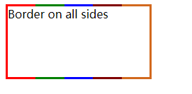

# CSS 笔记

本书翻译自 [CSS Notes for Professionals](https://goalkicker.com/CSSBook/)

## 第一章: CSS 入门

发布版本：

  1. 1996-12-17
  2. 1998-05-12
  3. 2015-10-13

### 1.1 小节：外部样式表（External Stylesheet）

通过在每个 HTML 文件中放置一个<link>标签，能将外部CSS样式表应用于任意数量的 HTML 文件中。
<link> 标签的属性rel必须设置为 "stylesheet"，href 属性应设置为样式表的相对或绝对路径。 虽然通常认为使用相对 URL 路径是一种好习惯，但也可以使用绝对路径。在 HTML5 中，可以省略 type 属性。
<link> 标签应该被放置在 <head> 标签中，以便于样式在应用之前被加载。否则应用样式时会出现一次闪烁。

```html
<!-- hello-world.html -->
<!DOCTYPE html>
<html>
<head>
  <meta charset="utf-8" />
  <link rel="stylesheet" type="text/css" href="style.css">
</head>
<body>
   <h1>Hello world!</h1>
   <p>I ♥ CSS</p>
</body>
</html>

```

```css
/* style.css */
h1 {
 color: green;
 text-decoration: underline;
}
p {
 font-size: 25px;
 font-family: 'Trebuchet MS', sans-serif;
}
```
href 推荐使用相对路径，也可以使用绝对路径。当有很多的页面时，将公共部分提取出来作为单独的样式表来加载可以提高后期修改的效率。

```html
<link rel="stylesheet" type="text/css" href="main.css">
<link rel="stylesheet" type="text/css" href="css/override.css">
```

### 1.2 内部样式表（Internal Styles）

在 html 页面中直接写入样式表

```html
<!DOCTYPE html>
<html>
<head>
  <style>
    h1 {
      color: green;
      text-decoration: underline;
    }
    p {
      font-size: 25px;
      font-family: 'Trebuchet MS', sans-serif;
    }
  </style>
</head>
<body>
  <h1>Hello world!</h1>
  <p>I ♥ CSS</p>
</body>
</html>
```

### 1.3 CSS @import 规则 (CSS 的规则之一)

```html
<style>
  /* 导入根目录的样式 */
  @import url('/css/styles.css');
  /* 导入外部样式，常见的是导入字体文件 */
  @import 'https://fonts.googleapis.com/css?family=Lato';
  /* 第二个可选参数是媒体查询列表 */
  @import '/print-styles.css' print;
  @import url('landscape.css') screen and (orientation:landscape);
</style>

```

### 1.4 行内样式(Inline Styles)

行内样式一般用于 js 设置标签的 CSS 属性

```html
<h1 style="color: green; text-decoration: underline;">Hello world!</h1>
<p style="font-size: 25px; font-family: 'Trebuchet MS';">I ♥ CSS</p>
```

### 1.5 JS 操作行内样式

```js
  var el = document.getElementById("element");
  el.style.opacity = 0.5;
  el.style.fontFamily = 'sans-serif';
// jQuery
$('#element').css('margin', '5px');
// 多个
$('#element').css({
  margin: "5px",
  padding: "10px",
  color: "black"
});
// 驼峰属性名
$('.example-class').css({
  "background-color": "blue",
  fontSize: "10px"
});

```

### 1.5 CSS 样式列表

css 可以设置多种样式，每个样式都有很多的属性值。如：list-style

```css
/* list-style 是 list-style-type list-style-image list-styleposition 的简写属性，以任何顺序接受一个，二个或者三个关键词
*/
/* list-style:list-style-type list-style-image list-styleposition; */
.one {
  list-style: circle;
}

.two {
  list-style: square inside;
}
```

## 第二章: CSS 的结构和格式规则

### 2.1 CSS 属性列表

一些属性可以采用多个值，这些值统称为属性列表。

```css
/* 此属性列表中有两个值 */
/*  */
span {
  text-shadow: yellow 0 0 3px, green 4px 4px 10px;
}
/* Alternate Formatting 备用格式，格式化后的格式，便于检查*/
span {
  text-shadow:
      yellow 0 0 3px,
      green 4px 4px 10px;
}
```

### 2.2 多个选择器

对CSS选择器进行分组时，可以将相同的样式应用于多个不同的元素，而无需在样式表中重复样式。使用逗号分隔多个分组的选择器。
```css
/* 所有的 div 和 p 标签内的字体颜色都是蓝色 */
div, p { color: blue; }
/* 所有的 p 标签, class="blue", id="first" 和 div 下的 span 标签的字体颜色为蓝色  */
p, .blue, #first, div span{ color : blue; }
```

### 2.3 规则，选择器和声明块

一个 css 的规则由一个选择器和一个声明块组成,声明快内部书写具体样式列表。
```css

h1{
  color: red;
}

```

## 第三章: 注释 （Comments）

```css
/* 单行注释 */
div {
  color: red; /* This is a CSS comment */
}
/* 
  多行
  注释 
*/

div {
  color: red;
}
```

## 第四章: 选择器 （Selectors）

### 4.1 基础选择器

|      选择器      |                               解释                                |
| :--------------: | :---------------------------------------------------------------: |
|        *         |                           选择所有标签                            |
|       div        |                    标签选择器，选择所有的 div                     |
|      .blue       |                     选择 class 有 blue 的标签                     |
|      #first      |                      选择 id 为 first 的标签                      |
|  :pseudo-class   |                            伪类选择器                             |
| ::pseudo-element | 伪元素选择器,例如：`::first-letter/::first-line/::after/::before` |
|    :lang(en)     |      匹配有lang属性的标签 ，例如：`<span lang="en"></span>`       |
|     div > p      |                           子元素选择器                            |

参考：https://www.w3.org/TR/selectors-3/#selectors

### 4.2 属性选择器

|     选择器     |           匹配示例           |                  释义                   |
| :------------: | :--------------------------: | :-------------------------------------: |
|     [attr]     |         `<div attr>`         |              有 attr 属性               |
|  [attr='val']  |      `<div attr="val">`      |            attr 属性值为 val            |
| [attr~='val']  | `<div attr="val val2 val3">` |            值列表中存在 val             |
| [attr^='val']  |   `<div attr="val1 val2">`   |       值列表中存在以 val 开头的值       |
| [attr$='val']  |   `<div attr="sth aval">`    |       值列表中存在以 val 结尾的值       |
| [attr*='val']  |  `<div attr="somevalhere">`  |        值列表中存在包含 val 的值        |
| [attr\|='val'] |  `<div attr="val-sth etc">`  |  值恰好为val 或者val 开头后跟连字符 -   |
| [attr='val' i] |      `<div attr="val">`      | i 不区分大小写，s区分大小写，兼容性较差 |

#### [attribute]

```html
<style>
div[data-color] {
  color: red;
}
</style>

<div data-color="red">This will be red</div>
<div data-color="green">This will be red</div>
<div data-background="red">This will NOT be red</div>
```

#### [attribute="value"]

```html
<style>
div[data-color="red"] {
 color: red;
}
</style>
<div data-color="red">This will be red</div>
<div data-color="green">This will NOT be red</div>
<div data-color="blue">This will NOT be red</div>
```

#### [attribute*="value"]

```html
<style>
[class*="foo"] {
 color: red;
}
</style>

<div class="foo-123">This will be red</div>
<div class="foo123">This will be red</div>
<div class="bar123foo">This will be red</div>
<div class="barfooo123">This will be red</div>
<div class="barfo0">This will NOT be red</div>
```

#### [attribute~="value"]

```html
<style>
[class~="color-red"] {
 color: red;
}
</style>

<div class="color-red foo-bar the-div">This will be red</div>
<div class="color-blue foo-bar the-div">This will NOT be red</div>
```

#### [attribute^="value"]

```html
<style>
[class^="foo-"] {
 color: red;
}
</style>

<div class="foo-123">This will be red</div>
<div class="foo-234">This will be red</div>
<div class="bar-123">This will NOT be red</div>
```

#### [attribute$="value"]

```html
<style>
[class$="file"] {
 color: red;
}
</style>

<div class="foobar-file">This will be red</div>
<div class="foobar-file">This will be red</div>
<div class="foobar-input">This will NOT be red</div>
```

#### [attribute|="value"]

```html
<style>
[lang|="EN"] {
 color: red;
}
</style>
<div lang="EN-us">This will be red</div>
<div lang="EN-gb">This will be red</div>
<div lang="PT-pt">This will NOT be red</div>
```

#### [attribute="value" i]

```html
<style>
[lang="EN" i] {
 color: red;
}
</style>

<div lang="EN">This will be red</div>
<div lang="en">This will be red</div>
<div lang="PT">This will NOT be red</div>
```

#### Other

```css
*[type=checkbox]{} /* 0-1-0 */
[id="my-ID"] /* 使用属性选择器会相对优先级比较低 */
```

### 组合选择器

|   选择器   |                       解释                       |
| :--------: | :----------------------------------------------: |
|  div span  |            后代选择器，所有层级的后代            |
| div > span |                    子代选择器                    |
|  a ~ span  | 兄弟标签选择器，选择 a 之后的所有的同层级的 span |
|  a + span  |     相邻兄弟选择器，所有 a 之后的第一个 span     |

#### 后代选择器

```html
<style>
div p {
 color:red;
}
</style>

<div>
 <p>My text is red</p>
 <section>
 <p>My text is red</p>
 </section>
</div>
<p>My text is not red</p>
```

#### 子代选择器

```html
<style>
div > p {
 color:red;
}
</style>

<div>
 <p>My text is red</p>
 <section>
 <p>My text is not red</p>
 </section>
 </div>
```

#### 兄弟选择器

```html
<style>
p ~ p {
 color:red;
}
</style>

<p>My text is not red</p>
<p>My text is red</p>
<hr>
<h1>And now a title</h1>
<p>My text is red</p>

```

#### 相邻兄弟选择器

```html
<style>
p + p {
 color:red;
}
</style>

<p>My text is not red</p>
<p>My text is red</p>
<p>My text is red</p>
<hr>
<p>My text is not red</p>
```

### 4.4 伪类选择器

`selector:pseudo-class { property: VALUE;}`, 常用的有 `:active`,`:hover`,`:link`,`visited`

### 4.5 child 伪类选择器

|  pseudo-selector   |   1   |   2   |   3   |   4   |   5   |   6   |   7   |   8   |   9   |  10   |
| :----------------: | :---: | :---: | :---: | :---: | :---: | :---: | :---: | :---: | :---: | :---: |
|    :first-child    |   √   |       |       |       |       |       |       |       |       |       |
|   :nth-child(3)    |       |       |   √   |       |       |       |       |       |       |       |
|  :nth-child(n+3)   |       |       |   √   |   √   |   √   |   √   |   √   |   √   |   √   |   √   |
|   :nth-child(3n)   |       |       |   √   |       |       |   √   |       |       |   √   |       |
|  :nth-child(3n+1)  |   √   |       |       |   √   |       |       |   √   |       |       |   √   |
|  :nth-child(-n+3)  |   √   |   √   |   √   |       |       |       |       |       |       |       |
|  :nth-child(odd)   |   √   |       |   √   |       |   √   |       |   √   |       |   √   |       |
|  :nth-child(even)  |       |   √   |       |   √   |       |   √   |       |   √   |       |   √   |
|    :last-child     |       |       |       |       |       |       |       |       |       |   √   |
| :nth-last-child(3) |       |       |       |       |       |       |       |   √   |       |       |

### 4.6 类名选择器

```css
.c-red{
  color:red;
}
.important {
 color: orange;
}
.warning {
 color: blue;
}
.warning.important {
 color: red;
}
```

### 4.7 id 选择器

```css
#element { ... } /* High specificity will override many selectors */
[id="element"] { ... } /* Low specificity, can be overridden easily */
```

### 4.8  :last-of-type

```html
<style>
p:last-of-type {
 background: #C5CAE9;
}
h1:last-of-type {
 background: #CDDC39;
}
</style>

<div class="container">
 <p>First paragraph</p>
 <p>Second paragraph</p>
 <p>Last paragraph</p>  <!-- #C5CAE9 -->
 <h1>Heading 1</h1>
 <h2>First heading 2</h2>
 <h2>Last heading 2</h2>  <!-- #CDDC39 -->
</div>

```

### 4.9 CSS3 :in-range 

```html
<style>
input:in-range {
 border: 1px solid blue;
}
</style>

<input type="number" min="10" max="20" value="15">
<p>The border for this value will be blue</p>

```

### 4.10 :not & :focus-within

```html
<style>
input:not([disabled]):not(.example) {
  background-color: #ccc;
}
/* 级别4 中支持，其他不支持 */
input:not([disabled], .example){
 background-color: #ccc;
}
div {
 height: 80px;
}
input{
 margin:30px;
}
/* 支持性较差 */
div:focus-within {
 background-color: #1565C0;
}

</style>

<form>
 Phone: <input type="tel" class="example">
 E-mail: <input type="email" disabled="disabled">
 Password: <input type="password">  <!-- #ccc -->
</form>

 <h3>Background is blue if the input is focused .</p>
 <div>
 <input type="text">
 </div>

```

### :checked

```html
<!-- 无 js 的弹窗层 -->
<style>
body {
  margin: 0;
}

/* animate EVERYTHING! - well, almost. */
* {
  transition: all .2s, height 1ms;
}

[for] {
  -webkit-touch-callout: none;
  -webkit-user-select: none;
  -khtml-user-select: none;
  -moz-user-select: none;
  -ms-user-select: none;
  user-select: none;
}

#container, #footer {
  width: calc(100% - 2em);
  color: #555;
  padding: 1em;
}
#darkThemeUsed:checked ~ #container,
#darkThemeUsed:checked ~ #footer {
  color: #eee;
}

#container {
  height: calc(100vh - 2em);
  background: #eee;
}
#darkThemeUsed:checked ~ #container {
  background: #333;
}

#sidebar {
  position: fixed;
  top: 0;
  bottom: 0;
  right: 0;
  width: 260px;
  background: #2196f3;
  margin-right: -304px;
  padding: 100px;
  color: #fff;
  box-shadow: 0 0 4px rgba(0, 0, 0, .5);
}
#sidebarShown:checked ~ #container #sidebar {
  margin-right: 0;
}
#darkThemeUsed:checked ~ #container #sidebar {
  background: #303f9f;
}

h3, h4 {
  margin: 0;
  margin-top: 1.5em;
  margin-bottom: .6em;
}

label {
  cursor: pointer;
}

label[for=darkThemeUsed]:after {
  content: "No"
}
#darkThemeUsed:checked ~ #container label[for=darkThemeUsed]:after {
  content: "Yes"
}

.button {
  display: inline-block;
  font-weight: bold;
  line-height: 36px;
  text-align: center;
  padding: 0 8px;
  min-width: 100px;
  background: rgba(0, 0, 0, .1);
  box-shadow: 0 1px 2px rgba(0, 0, 0, .3);
  text-transform: uppercase;
  font-size: 90%
}
#darkThemeUsed:checked ~ * .button {
  background: rgba(255, 255, 255, .1);
  box-shadow: 0 1px 2px rgba(0, 0, 0, .8);
}

#footer {
  height: 100px;
  position: fixed;
  bottom: 0;
  background: #ddd;
}
#darkThemeUsed:checked ~ #footer {
  background: #444;
}
</style>

<input type="checkbox" id="sidebarShown" hidden />
<input type="checkbox" id="darkThemeUsed" hidden />

<!-- here begins actual content, for example: -->
<div id="container">
    <div id="sidebar">
        <label for="sidebarShown" class="button">x</label>
        <h3>Super cool sidebar</h3>
        <p>Lorem ipsum dolor sit amet, consetetur sadipscing elitr, sed diam nonumy eirmod tempor invidunt ut labore et dolore magna aliquyam erat, sed diam voluptua. At vero eos et accusam et justo duo dolores et ea rebum. Stet clita kasd gubergren, no sea takimata sanctus est Lorem ipsum dolor sit amet. Lorem ipsum dolor sit amet, consetetur sadipscing elitr, sed diam nonumy eirmod tempor invidunt ut labore et dolore magna aliquyam erat, sed diam voluptua.
        </p>
    </div>

    <h3>Sample page</h3>
    
    <p>
        <label for="darkThemeUsed">Use dark theme? – </label>
    </p>
    
    <label for="sidebarShown" class="button">Toggle sidebar</label>
</div>

<div id="footer">
    (c) The 0815 Company
</div>
```

### 4.12 ID 选择器

```html
<style>
#exampleID {
 width: 100px;
}

</style>

<div id="exampleID">
 <p>Example</p>
</div>

```
### 4.13 如何引用样式在 一个 `type=range` input 上

```html
<input type="range" />

```

```css
/* Thumb */
input[type=range]::-webkit-slider-thumb, input[type=range]::-moz-range-thumb,
input[type=range]::-ms-thumb{}
/* Track */
input[type=range]::-webkit-slider-runnable-track, input[type=range]::-moz-range-track,
input[type=range]::-ms-track{}
/* OnFocus */
input[type=range]:focus{}
/* Lower part of the track */
input[type=range]::-moz-range-progress, input[type=range]::-ms-fill-lower{}/* (not possiblein WebKit browsers currently - JS needed) */
```

### 4.14 :only-child

```html
<style>
  p:only-child {
   color: blue;
  }
</style>

<div>
  <p>This paragraph is the only child of the div, it will have the color blue</p><!--blue-->
</div>
<div>
  <p>This paragraph is one of the two children of the div</p>
  <p>This paragraph is one of the two children of its parent</p>
</div>

```

## 第五章: Backgrounds

使用CSS，您可以将颜色，渐变和图像设置为元素的背景。
可以指定图像，颜色和渐变的各种组合，并调整 size，position和 repeat（以及其他）。

### 5.1 background-color

能在所有的标签上生效，`::first-letter/::first-line`伪元素也可以生效。

可以使用的值有：颜色值，transparent，inherit，initial。颜色值可以使用颜色名（如：`red`），Hex 颜色值（如：`#de1205`），RGB/RGBa 颜色值（如：`rgb(23,23,23)/rgba(0,0,0,0.5)`），HSL/HSLa 颜色值（如：`hsl(120 100% 50%)/hsla(120,100%,50%,.3)`）。

示例：

```css
/* 颜色值具体可以查看 https://developer.mozilla.org/zh-CN/docs/Web/CSS/color_value */
div {
 background-color: red; /* red */
}
/* 每两位代表一个16进制颜色值，最大ff */
body {
 background-color: #de1205; /* red */
}
.main {
 background-color: #00f; /* blue */
}
/* 每个逗号分隔代表一个10进制颜色值，最大255 */
header {
 background-color: rgb(0, 0, 0); /* black */
}
/* 透明度 0-1 ，1 完全不透明 */
footer {
 background-color: rgba(0, 0, 0, 0.5); /* black with 50% opacity */
}
/* HSL代表色调，饱和度和亮度 色调是色轮上的度数（从0到360）。饱和度是介于0％和100％之间的百分比。亮度也是0％到100％之间的百分比。 */
li a {
 background-color: hsl(120, 100%, 50%); /* green */
}
/* 透明度 0-1 ，1 完全不透明 */
#p1 {
 background-color: hsla(120, 100%, 50%, .3); /* green with 30% opacity */
}
```

**和background-image 组合使用**

```css
/* 这种是等价的，它们都会导致图像下方显示红色，其中图像的各个部分是透明的，或图像未显示（可能是由于背景重复）。 */
body {
 background: red;
 background-image: url(partiallytransparentimage.png);
}
body {
 background-color: red;
 background-image: url(partiallytransparentimage.png);
}
body {
 background-image: url(partiallytransparentimage.png);
 background-color: red;
}
body {
 background: red url(partiallytransparentimage.png);
}
/* 这种会被覆盖 */
body {
 background-image: url(partiallytransparentimage.png);
 background: red;
}
```

### 5.2 背景颜色的渐变（ Background Gradients）

渐变是 CSS3 中添加的类型，使用 background-image 属性设置渐变或使用 background 简写属性。
渐变函数有两种类型，线性渐变（linear-gradient）和径向渐变（radial-gradient）。 每种类型都有一个非重复的变体和一个重复的变体：

- **linear-gradient()** 
- **repeating-linear-gradient()** 
- **radial-gradient()** 
- **repeating-radial-gradient()**

#### linear-gradient()

语法： 

> background: linear-gradient( <direction>?, <color-stop-1>,<color-stop-2> ,...);

- <direction>：to top, to bottom, to right, to left 还可以使用deg，grad，rad，turn。为空则从上到下
- <color-stop>：颜色 位置，如：yellow 10%，rgba(0,0,0,0.5) 40px, #fff 100% ...

例如：

```css
.linear-gradient {
  /* 从右到左，从红色过渡到蓝色的线性渐变*/
  background: linear-gradient(to left, red, blue); /* you can also use 270deg */
}
/* 从右下角到左上角，从红色到黄色再到红色的线性渐变 从10%-100%都是黄色*/
.diagonal-linear-gradient {
  background: linear-gradient(to left top, red, yellow 10%);
}
/* 都好分隔可以有任意多个线性渐变 */
.linear-gradient-rainbow {
  background: linear-gradient(to left, red, orange, yellow, green, blue, indigo, violet);
}
/* 径向渐变 https://developer.mozilla.org/en-US/docs/Web/CSS/radial-gradient() */
.radial-gradient-simple {
  background: radial-gradient(red, blue);
}
/* 渐变的形状的值可以为 circle 或者 ellipse（椭圆） 默认值是椭圆 */
/* 渐变的结束形状多大  closest-side, farthestside, closest-corner, farthest-corner*/
/* 最近的一个边，最远的一个边，最近的顶点，最远的顶点 */
/* 中心点的位置 */
.radial-gradient {
  background: radial-gradient(circle farthest-corner at top left, red, blue);
}
/* 平铺，不会由最后的颜色一致到结尾，会重复填充 */
.bullseye {
  background: repeating-radial-gradient(red, red 10%, white 10%, white 20%);
}
.warning {
  background: repeating-linear-gradient(-45deg, yellow, yellow 10%, black 10%, black 20%);
}

```

### 5.3 背景图片

```css
/* 值 none initial inherit 和 url("URI") 默认值 initial */
.myClass {
   background-image: url('/path/to/image.jpg');
}

.myClass {
   background-image: url('/path/to/image.jpg'),
 				     url('/path/to/image2.jpg');
}

```

### 5.4 Background 属性简写

```css
/*
background: [<background-image>] [<background-color>] [<background-position>]/[<background-size>]
[<background-repeat>] [<background-origin>] [<background-clip>] [<background-attachment>]
[<initial|inherit>]; 
*/
.css{
    background: red;
    background: border-box red;
    background: no-repeat center url("somepng.jpg");
    background: url('pattern.png') green;
    background: #000000 url("picture.png") top left / 600px auto no-repeat;
}
```

### 5.5 background-size

```css
.my-class{
    /* 省略的值为auto */
    background-size: 50px;
    /* 需要保持缩放比，可以设置一个值为 auto */
	background-size: 50px auto;
	background-size: auto 50px;
	background-size: 50px 50px;
    background-size: 100% 66%; /* 相对于宽高的百分比 */
    /*保持宽高比的情况下，让图片可以全部显示 */
	background-size: contain;
    /* 保持宽高比的情况下，填充满整个空间 */
    background-size: cover;
}

```

示例：

```html
<style>
div > div {
 background-image: url(http://i.stack.imgur.com/r5CAq.jpg);
 background-repeat: no-repeat;
 background-position: center center;
 background-color: #ccc;
 border: 1px solid;
 width: 20em;
 height: 10em;
}
div.contain {
 background-size: contain;
}
div.cover {
 background-size: cover;
}
/********************************************
 Additional styles for the explanation boxes
*********************************************/
div > div {
 margin: 0 1ex 1ex 0;
 float: left;
}
div + div {
 clear: both;
 border-top: 1px dashed silver;
 padding-top:1ex;
}
div > div::after {
 background-color: #000;
 color: #fefefe;
GoalKicker.com – CSS Notes for Professionals 31
 margin: 1ex;
 padding: 1ex;
 opacity: 0.8;
 display: block;
 width: 10ex;
 font-size: 0.7em;
 content: attr(class);
}
</style>
<div>
 <div class="contain"></div>
 <p>Note the grey background. The image does not cover the whole region, but it's fully
<em>contained</em>.
 </p>
</div>
<div>
 <div class="cover"></div>
 <p>Note the ducks/geese at the bottom of the image. Most of the water is cut, as well as a part
of the sky. You don't see the complete image anymore, but neither do you see any background color;
the image <em>covers</em> all of the <code>&lt;div&gt;</code>.</p>
</div>

```

### 5.6 background-position

可以使用 left，top，bottom，right center 等关键字，或百分比值，px值，rem值来设置

```css
.my-class{
  /* x y */
  background-image: url('path/to/image.jpg');
  background-position: 50% 50%;
  background-position: center;
  background-position: 0 10px;
  background-position: 10% 0;
  background-position: 1rem 0;
}
```

### 5.7 background-origin

background-position移动的原点，值有 padding-box，border-box，content-box，inherit，initial

```html
<style>
.example {
  width: 300px;
  border: 100px solid rgba(196,196,196,.3);
  padding: 50px;
  background: url(https://static.pexels.com/photos/6440magazines-desk-work-workspace-medium.  jpg);
  background-repeat: no-repeat;
}
.example1 {background-origin: padding-box;}
.example2 { background-origin: border-box; }
.example3 { background-origin: content-box; }
</style>

<p>No background-origin (padding-box is default):</p>
GoalKicker.com – CSS Notes for Professionals 33
<div class="example example1">
 <h2>Lorem Ipsum Dolor</h2>
 <p>Lorem ipsum dolor sit amet, consectetuer adipiscing elit, sed diam nonummy nibh euismod
tincidunt ut laoreet dolore magna aliquam erat volutpat.</p>
 <p>Ut wisi enim ad minim veniam, quis nostrud exerci tation ullamcorper suscipit lobortis nisl ut
aliquip ex ea commodo consequat.</p>
</div>
<p>background-origin: border-box:</p>
<div class="example example2">
 <h2>Lorem Ipsum Dolor</h2>
 <p>Lorem ipsum dolor sit amet, consectetuer adipiscing elit, sed diam nonummy nibh euismod
tincidunt ut laoreet dolore magna aliquam erat volutpat.</p>
 <p>Ut wisi enim ad minim veniam, quis nostrud exerci tation ullamcorper suscipit lobortis nisl ut
aliquip ex ea commodo consequat.</p>
</div>
<p>background-origin: content-box:</p>
<div class="example example3">
 <h2>Lorem Ipsum Dolor</h2>
 <p>Lorem ipsum dolor sit amet, consectetuer adipiscing elit, sed diam nonummy nibh euismod
tincidunt ut laoreet dolore magna aliquam erat volutpat.</p>
 <p>Ut wisi enim ad minim veniam, quis nostrud exerci tation ullamcorper suscipit lobortis nisl ut
aliquip ex ea commodo consequat.</p>
</div>
```

- More:
  https://www.w3.org/TR/css-backgrounds-3/#the-background-origin
  https://developer.mozilla.org/en-US/docs/Web/CSS/background-origin

### 5.8 多张背景图片

```css
#mydiv {
  background-image: url(img_1.png), /* top image */
  url(img_2.png), /* middle image */
  url(img_3.png); /* bottom image */
  background-position: right bottom,left top,right top;
  background-repeat: no-repeat,repeat,no-repeat;
}
#mydiv {
  background: url(img_1.png) right bottom no-repeat,
  url(img_2.png) left top repeat,
  url(img_3.png) right top no-repeat;
}

#mydiv {
  background: url(image.png) right bottom no-repeat,
  linear-gradient(to bottom, #fff 0%,#000 100%);
}
```

### 5.9 background-attachment

background-attachment属性设置背景图像是固定的还是与页面的其余部分一起滚动。值有：scroll，fixed，local，initial，inherit。默认scroll

```css
body {
  background-image: url('img.jpg');
  background-attachment: fixed;
}
/* 当div滚动时背景图滚动 */
div{
  background-image: url('image.jpg');
  background-attachment: local;
}
```

### 5.10  background-clip

background-clip属性指定背景的绘制区域。默认值：border-box，其他值：content-box，padding-box，inherit。

```html
<style>
.example {
 width: 300px;
 border: 100px solid rgba(196,196,196,.3);
 padding: 50px;
 background: url(https://static.pexels.com/photos/6440/magazines-desk-work-workspace-medium.jpg);
 background-repeat: no-repeat;
}
.example1 { background-clip: padding-box;}
.example2 { background-clip: border-box; }
.example3 { background-clip: content-box;}
</style>

<p>No background-clip (padding-box is default):</p>
<div class="example example1">
 <h2>Lorem Ipsum Dolor</h2>
 <p>Lorem ipsum dolor sit amet, consectetuer adipiscing elit, sed diam nonummy nibh euismod
tincidunt ut laoreet dolore magna aliquam erat volutpat.</p>
 <p>Ut wisi enim ad minim veniam, quis nostrud exerci tation ullamcorper suscipit lobortis nisl ut
aliquip ex ea commodo consequat.</p>
</div>
<p>background-clip: border-box:</p>
<div class="example example2">
 <h2>Lorem Ipsum Dolor</h2>
 <p>Lorem ipsum dolor sit amet, consectetuer adipiscing elit, sed diam nonummy nibh euismod
tincidunt ut laoreet dolore magna aliquam erat volutpat.</p>
 <p>Ut wisi enim ad minim veniam, quis nostrud exerci tation ullamcorper suscipit lobortis nisl ut
aliquip ex ea commodo consequat.</p>
</div>
<p>background-clip: content-box:</p>
<div class="example example3">
 <h2>Lorem Ipsum Dolor</h2>
 <p>Lorem ipsum dolor sit amet, consectetuer adipiscing elit, sed diam nonummy nibh euismod
tincidunt ut laoreet dolore magna aliquam erat volutpat.</p>
 <p>Ut wisi enim ad minim veniam, quis nostrud exerci tation ullamcorper suscipit lobortis nisl ut
aliquip ex ea commodo consequat.</p>
</div>

```

### 5.11 background-repeat

当背景图小于标签宽高是的是否重复的设置，值有：repeat，repeat-y，repeat-x，no-repeat。

```html
<style>
.my-div {
  width: 300px;
  height: 200px;
  background-size: 100%;
  background-repeat: no-repeat;
  background-image: linear-gradient(to right, black 0%,white 100%),
  url('https://static.pexels.com/photos/54624/strawberry-fruit-red-sweet-54624-medium.jpeg');
  background-blend-mode:saturation;
}
</style>
<div class="my-div">Lorem ipsum</div>
```

` background-blend-mode: normal | multiply | screen | overlay | darken | lighten | color-dodge | saturation | color | luminosity;`

background-blend-mode 属性定义了背景层的混合模式（图片与颜色）。IE 不支持

### 5.13  背景颜色不透明度

```css
/* Fallback for web browsers that don't support RGBa */
background-color: rgb(0, 0, 0);
/* RGBa with 0.6 opacity */
background-color: rgba(0, 0, 0, 0.6);
/* For IE 5.5 - 7*/
filter: progid:DXImageTransform.Microsoft.gradient(startColorstr=#99000000, endColorstr=#99000000);
/* For IE 8*/
-ms-filter: "progid:DXImageTransform.Microsoft.gradient(startColorstr=#99000000,
endColorstr=#99000000)";
```

## 第六章 居中

### 6.1 flexbox

```html
<style>
html, body, .container {
  height: 100%;
}
.container {
  display: flex;
  justify-content: center; /* horizontal center */
}
img {
  align-self: center; /* vertical center */
}

</style>
<div class="container">
  
</div>

<style>
html, body {
 height: 100%;
}
body {
 display: flex;
 justify-content: center; /* horizontal center */
 align-items: center; /* vertical center */
}
img {
  align-self: center; /* vertical center */
}

</style>


```

浏览器支持：

- 除10之前的IE版本外，所有主要浏览器均支持Flexbox。
- 某些最新的浏览器版本（例如Safari 8和IE10）需要供应商前缀。
- 为了快速生成前缀，可以使用第三方工具[Autoprefixer](https://autoprefixer.github.io/)。
- 对于较旧的浏览器（例如IE 8和9），可以使用[Polyfill]( https://github.com/jonathantneal/flexibility)。并不完美
- 有关Flexbox浏览器支持的更多详细信息，请参见 [http://caniuse.com/#search=flex](http://caniuse.com/#search=flex)。

### 6.2 transform

```html
<style>
.container {
  position: relative;
}
.element {
  position: absolute;
  top: 50%;
  left: 50%;
 -webkit-transform: translate(-50%, -50%); /* Chrome, Safari, Opera, Android */
 -ms-transform: translate(-50%, -50%); /* IE 9 */
 transform: translate(-50%, -50%);
}
/*图像和文字变虚可以使用这个文章解决方案 https://stackoverflow.com/questions/6411361/webkit-based-blurry-distorted-text-post-animation-via-translate3d/32329785#32329785 */
/* transform: translateX(-50%) translateX(.5px) */

</style>

<div class="container">
 <div class="element"></div>
</div>
```

- 在此居中方法中使用非静态宽度/高度元素会导致居中的元素显得压扁。 这主要发生在包含文本的元素上，可以通过添加以下内容来解决：margin-right：-50％; margin-bottom：-50％;。 [查看此处](https://jsfiddle.net/4xxmxca0/)以获取更多信息。

### 6.3 使用 margin: 0 auto;

`margin: 0 auto`使用在有宽高的块级元素上，让其水平居中

```css
<style>
.containerDiv {
 width: 100%;
 height: 100px;
 padding-bottom: 40px;
}
#centeredDiv {
 margin: 0 auto;
 width: 200px;
 height: 100px;
 border: 1px solid #000;
}
#centeredParagraph {
 width: 200px;
 margin: 0 auto;
}
#centeredImage {
 display: block;
 width: 200px;
 margin: 0 auto;
}
</style>

<div class="containerDiv">
 <div id="centeredDiv"></div>
</div>
<div class="containerDiv">
 <p id="centeredParagraph">This is a centered paragraph.</p>
</div>
<div class="containerDiv">
 
</div>

```

### 6.4 text-align

文本居中，也可以使 `dispaly:inline-block;`，`dispaly:inline;`的元素居中。

```css
p{
    text-align:center; /* center left right*/
}
```

### 6.5 position: absolute;

ie8 以上都支持

```html
<style>
/* 居中的演示地址 https://codepen.io/shshaw/details/gEiDt */
.parent {
  position: relative;
  height: 500px;
}
.center {
  position: absolute;
  margin: auto;
  top: 0;
  right: 0;
  bottom: 0;
  left: 0;
}
</style>
<div class="parent">
 
</div>
```

### 6.6 calc()

ie9 以上都支持,需要前缀 -webkit-， -moz- 。需要固定的宽高

```html
<style>
.center {
  position: absolute;
  height: 50px;
  width: 50px;
  background: red;
  top: calc(50% - 50px / 2); /* height divided by 2*/
  left: calc(50% - 50px / 2); /* width divided by 2*/
}

</style>

<div class="center"></div>
```

### 6.7line-height

使单行的文本垂直居中，可以使用 vertical-align 来精确修改。

```css
div{
  width: 200px;
  height:200px;
  line-height: 200px;
  text-align: center;
  vertical-align: middle;
}
```

### 6.8 多行文字居中

ie9 以上都支持,需要前缀 -webkit-， -moz- -ms-。需要父元素有固定的高度

```html
<style>
div.vertical {
  position: relative;
  top: 50%;
  transform: translateY(-50%);
}
</style>

<div class="vertical">
  Vertical aligned text!<br />
  Vertical aligned text!
</div>
```

### 6.9 相对于另一个项目居中

ie8 以上都支持,container 必须 `display:table;`，details 必须要有宽度并且`display:table-cell;vertical-align: middle;`， thumb 必须有 `width:100%;`宽度受 details的影响占据剩余空间。

```html
<style>
.content * {
  box-sizing: border-box;
}
.content .position-container {
  display: table;
}
.content .details {
  display: table-cell;
  vertical-align: middle;
  width: 33.333333%;
  padding: 30px;
  font-size: 17px;
  text-align: center;
}
.content .thumb {
  width: 100%;
}
.content .thumb img {
  width: 100%;
}
</style>

<div class="content">
  <div class="position-container">
    <div class="thumb">
      
    </div>
    <div class="details">
      <p class="banner-title">text 1</p>
      <p class="banner-text">content content content content content content content content
        content content content content content content</p>
      <button class="btn">button</button>
    </div>
  </div>
</div>
```

### 6.9 伪元素技巧

ie8 以上都支持,container 必须 `display:table;`，details 必须要有宽度并且`display:table-cell;vertical-align: middle;`， thumb 必须有 `width:100%;`宽度受 details的影响占据剩余空间。

```html
<style>
  /* 此父级可以是任何宽度和高度 */
  .block {
    text-align: center;
    /* 如果容器有可能比内部元素窄，则可能要这样做*/
    white-space: nowrap;
  }

  /* 伪元素 */
  .block:before {
    content: '';
    display: inline-block;
    height: 100%;
    vertical-align: middle;
    /* 幽灵元素和.centered之间存在间隙，这是由渲染的空格字符引起的。 可以通过轻推.centered（轻推距离取决于字体系列），或将.parent中的font-size归零，然后在.centered中将其重置为（可能为1rem）来消除。 */
    margin-right: -0.25em;
  }

  /* 要居中的元素，也可以是任何宽度和高度 */
  .centered {
    display: inline-block;
    vertical-align: middle;
    width: 300px;
    white-space: normal;
    /* 重置继承的 nowrap 行为 */
  }
</style>

<div class="block">
  <div class="centered"></div>
</div>
```

### 6.11 垂直和水平居中，无需担心高度或宽度

- **outer-container** 必须具有 `display:table;`
- **inner-container** 必须具有 `display:table-cell; vertical-align:middle;text-align:center;`
- **content-box** 必须具有 `display:inline-block;`,可以将文本顺序调整为 left，不然将继承 center


```html
<style>
  body {
    margin: 0;
  }

  .outer-container {
    position: absolute;
    display: table;
    width: 100%;  /* 可以是任何宽 */
    height: 100%; /* 可以是任何高 */
    background: #ccc;
  }

  .inner-container {
    display: table-cell;
    vertical-align: middle;
    text-align: center;
  }

  .centered-content {
    display: inline-block;
    text-align: left;
    background: #fff;
    padding: 100px;
    border: 1px solid #000;
  }
</style>

<div class="outer-container">
  <div class="inner-container">
    <div class="centered-content">
      You can put anything here!
    </div>
  </div>
</div>

```

###  6.12 在div中垂直对齐图像

```html
<style>
  .wrap {
    height: 50px;
    /* max image height */
    width: 100px;
    border: 1px solid blue;
    text-align: center;
  }

  .wrap:before {
    content: "";
    display: inline-block;
    height: 100%;
    vertical-align: middle;
    width: 1px;
  }

  img {
    vertical-align: middle;
  }
</style>

<div class="wrap">
  
</div>
```

### 6.13 以固定大小居中

```html
/* 也可以单独使用top margin-top，left margin-left 来单独设置垂直和水平的居中 */
<style>
.center {
  position: absolute;
  background: #ccc;
  left: 50%;
  width: 150px;
  margin-left: -75px; /* width * -0.5 */
  top: 50%;
  height: 200px;
  margin-top: -100px; /* height * -0.5 */
}
</style>

<div class="center">
  Center vertically and horizontally
</div>
```

### 6.14 垂直对齐动态高度元素

```html
/* 
   使用辅助元素来解决问题 
   https://stackoverflow.com/questions/12415661/using-marginauto-to-vertically-align-a-div/12417336#12417336 
*/
<style>
  .vcenter--container {
    display: table;
    height: 100%;
    position: absolute;
    overflow: hidden;
    width: 100%;
  }

  .vcenter--helper {
    display: table-cell;
    vertical-align: middle;
  }

  .vcenter--content {
    margin: 0 auto;
    width: 200px;
  }
</style>

<div class="vcenter--container">
  <div class="vcenter--helper">
    <div class="vcenter--content">
      <!--stuff-->
    </div>
  </div>
</div>

```

### 6.14 使用表格进行水平和垂直居中

```html
/* 也可以单独使用top margin-top，left margin-left 来单独设置垂直和水平的居中 */
<style>
.wrapper {
  display: table;
  vertical-align: center;
  width: 200px;
  height: 200px;
  background-color: #9e9e9e;
}
.parent {
  display: table-cell;
  vertical-align: middle;
  text-align: center;
}
.child {
  display: inline-block;
  vertical-align: middle;
  text-align: center;
  width: 100px;
  height: 100px;
  background-color: teal;
}
</style>

<div class="wrapper">
  <div class="parent">
    <div class="child"></div>
  </div>
</div>

```

## 盒模型

|    参数     |                       释义                       |
| :---------: | :----------------------------------------------: |
| content-box |       Width 和 height 只包含 content area.       |
| padding-box |     Width 和 height 包含 content 和 padding.     |
| border-box  | Width 和 height 包含 content, padding 和 border. |
|   initial   |                 设置到默认的状态                 |
|   inherit   |                    继承父元素                    |

### 7.1 什么是盒模型


> Edges：边缘，TM：Top margin BP：Bottom padding 。

### 7.2 box-sizing

默认值：content-box，其他值：padding-box,border-box，inherit。


```css
textarea {
  width: 100%;
  padding: 3px;
  box-sizing: border-box;
}
/* 应用到所有元素 */
html {
  box-sizing: border-box;
}
*, *:before, *:after {
  box-sizing: inherit;
}

```

## 第 8 章 Margin

|      参数       |                    释义                    |
| :-------------: | :----------------------------------------: |
|        0        |                  无外边距                  |
|      auto       | 自动计算，其他影响值固定则自动占据剩余位置 |
| 单位值，如：1px |               设置数值+单位                |
|     inherit     |                    继承                    |
|     initial     |               重置到初始化值               |

### 8.1 margin 合并

当两个外边距垂直相互接触时，它们将被合并。 水平接触时不会。如两个上下相邻的元素，父元素和第一个子元素的 margin-top，父元素和最后一个子元素的margin-bottom。合并时取最大值。

```html
<!-- div 之间的空间为 10px -->
<style>
div{
  margin:10px;
}
</style>
<div>some content</div>
<div>some more content</div>
<!-- 父子之间 -->
<style>
.outer-top{
  margin: 10px;
}
.inner-top{
  margin: 15px;
}
.outer-bottom{
  margin: 100px;
}
.inner-bottom{
  margin: 25px;
}
</style>
<div class="outer-top">
  <div class="inner-top">
    some content
  </div>
</div>
<div class="outer-bottom">
  <div class="inner-bottom">
    some more content
  </div>
</div>
<!-- 当加入 div{border:1px solid red;} 时，父子之间垂直外边距不再合并，outer 之间的垂直外边距继续合并取最大值 -->
```

### 8.2 在给定边上应用 margin 值

有四个属性，分别对应四条边：`margin-top`，`margin-right`，`margin-bottom`，`margin-left`，简写属性：`margin: <top> <right> <bottom> <left>;`。

### 8.3 简写属性示例

```css
p {
 margin:1px; /* 1px margin in all directions */

 /*equals to:*/

 margin:1px 1px;

 /*equals to:*/

 margin:1px 1px 1px;

 /*equals to:*/

 margin:1px 1px 1px 1px;
}

p{
 margin:10px 15px; /* 10px margin-top & bottom And 15px margin-right & left*/

 /*equals to:*/

 margin:10px 15px 10px 15px;

 /*equals to:*/

 margin:10px 15px 10px;
 /* margin left will be calculated from the margin right value (=15px) */
}

```

### margin 水平居中

```css

#myDiv{
  width: 80%;
  margin: 0 auto;
}
```

### margin 百分比值相对于他的父元素

margin 的百分比值的基础值都是父元素的 width 值。

```css
.parent {
  width : 500px;
  height: 300px;
}
.child {
  width : 100px;
  height: 100px;
  margin-left: 10%; /* (parentWidth * 10/100) => 50px */
  margin-top: 20%; /* (parentWidth * 20/100) => 100px */
}

```

### margin 的负值

负值让元素向相反的方向移动

```css
div{
  display: inline;
}
#over{
  margin-left: -100px;
}

```
```html
<div>Base div</div>
<div id="over">Overlapping div</div>
```

## 第 9 章 内边距 padding

### 9.1 padding 的简写

```html
<style>
 .myDiv {
   padding: 25px 50px 75px 100px; /* top right bottom left; */
 }
</style>
<div class="myDiv"></div>

<style>
 .myDiv {
   padding: 25px 50px 75px; /* top left/right bottom */
 }
</style>
<div class="myDiv"></div>

<style>
 .myDiv {
   padding: 25px 50px; /* top/bottom left/right */
 }
</style>
<div class="myDiv"></div>

<style>
 .myDiv {
   padding: 25px;  /* top/right/bottom/left */
 }
</style>
<div class="myDiv"></div>
```

### 单独设置一条边的 padding

```html
<!-- padding-top padding-right padding-bottom padding-left -->

<style>
.myClass {
  padding-top: 5px;
}
</style>
<div class="myClass"></div>
```

## 第 10 章 边框 border

### 10.1 border-radius

border-radius 属性改变元素边框为圆角。元素的每个角最多可以有两个值，即该角的垂直和水平半径（最多8个值）


`border-radius: 10px 5% / 100px 25em 30px 35em;` 第一组值定义水平半径，可选的第二组值(以 / 开头)定义了垂直半径。如果仅仅提供一组值，则将其应用于水平和垂直半径。

10px是 top-left 和 bottom-right 的水平半径。 5％是 top-right 和 bottom-left 的水平半径。 '/'之后的其他四个值是top-left，top-right，bottom-right 和 bottom-left 的垂直半径。

`border-radius: 50%;` 元素从矩形变为圆形，但所占空间认为矩形

```css
/* 单独设置 */
 -webkit-border-top-right-radius: 4px;
 -webkit-border-bottom-right-radius: 4px;
 -webkit-border-bottom-left-radius: 0;
 -webkit-border-top-left-radius: 0;
 -moz-border-radius-topright: 4px;
 -moz-border-radius-bottomright: 4px;
 -moz-border-radius-bottomleft: 0;
 -moz-border-radius-topleft: 0;
 border-top-right-radius: 4px;
 border-bottom-right-radius: 4px;
 border-bottom-left-radius: 0;
 border-top-left-radius: 0;
```

### 10.2 border-style

border-style属性设置元素边框的样式。 此属性可以有一到四个值（对于元素的每一侧都有一个值。）

<div>
  <span style="display:inline-block;line-height:100px;text-align:center;width:100px;height:100px;border-style:solid;">solid</span>
  <span style="display:inline-block;line-height:100px;text-align:center;width:100px;height:100px;border-style:dotted;">dotted</span>
  <span style="display:inline-block;line-height:100px;text-align:center;width:100px;height:100px;border-style:dashed;">dashed</span>
  <span style="display:inline-block;line-height:100px;text-align:center;width:100px;height:100px;border-style:double;">double</span>
  <span style="display:inline-block;line-height:100px;text-align:center;width:100px;height:100px;border-style:groove;">groove</span>
  <span style="display:inline-block;line-height:100px;text-align:center;width:100px;height:100px;border-style:ridge;">ridge</span>
  <span style="display:inline-block;line-height:100px;text-align:center;width:100px;height:100px;border-style:inset;">inset</span>
  <span style="display:inline-block;line-height:100px;text-align:center;width:100px;height:100px;border-style:outset;">outset</span>
</div> 

border-style也可以使用值none和hidden，它们具有相同的效果。在具有多个边框的`<table>`中，none优先级最低（边框会显示出来），而 hidden 的优先级最高（在冲突中，边框不会显示）。

### 10.3 多个边框

**outline**

```css
.div1{
  border: 3px solid black;
  outline: 6px solid blue;
  width: 100px;
  height: 100px;
  margin: 20px;
}
```

**box-shadow**

```css
.div2{
  border: 5px solid green;
  box-shadow: 0px 0px 0px 4px #000;
  width: 100px;
  height: 100px;
  margin: 20px;
}
```

**pseudo element 伪元素**

```css
.div3 {
  position: relative;
  border: 5px solid #000;
  width: 100px;
  height: 100px;
  margin: 20px;
}
.div3:before {
  content: " ";
  position: absolute;
  border: 5px solid blue;
  z-index: -1;
  top: 5px;
  left: 5px;
  right: 5px;
  bottom: 5px;
}
```

<div style="height:120px;">
  <span style="float:left;display:inline-block;border: 3px solid black;outline: 6px solid blue;width: 100px;height: 100px;margin: 20px;"></span>
  <span style="float:left;display:inline-block;border: 5px solid green;box-shadow: 0px 0px 0px 4px #000;width: 100px;height: 100px;margin: 20px;"></span>
  
</div>


### 10.4 border 简写

```css
div{
  border-width: 1px;
  border-style: solid;
  border-color: #000;
  border-top-width:2px;
}
.div1{
  border: 1px solid #000;
}
.div2{
  border-top: 2px double #aaaaaa;
}
```

### 10.5 border-collapse

border-collapse属性仅适用于 table（以及显示为display：table或inlinetable的元素），设置边框是否折叠。

- collapse 边框会合并为一个单一的边框。忽略 border-spacing 和 empty-cells 属性
- separate 默认值。边框会被分开。不会忽略 border-spacing 和 empty-cells 属性
- inherit 规定应该从父元素继承 border-collapse 属性的值

```css
table {
 border-collapse: separate; /* default */
 border-spacing: 2px; /* 仅在边框不折叠的情况下有效 */
}
```

### 10.6 border-image

使用border-image属性，您可以设置要使用的图像，而不是普通的边框样式。ie11+

border-image 主要由以下几个部分组成: 

`border-image: source slice width outset repeat|initial|inherit;`

- border-image-source 图片路径
- border-image-slice 指定用于将图像分为九个区域（四个角，四个边缘和一个中间）的偏移量
- border-image-width	图像边界的宽度
- border-image-outset	用于指定在边框外部绘制 border-image-area 的量
- border-image-repeat 指定如何缩放边框图像的侧面和中间的图像

```css
#borderimg { 
    -webkit-border-image: url(border.png) 30 round; /* Safari3.1-5,Chrome4.0-16.0 */
    -o-border-image: url(border.png) 30 round; /* Opera 11-12.1 */
    -moz-border-image: url(border.png) 30 round;  /*15.0-3.5 Firfox*/
    border-image: url(border.png) 30 round;
}
```

### 10.7 border-image 创建多色边框

```html
<style>
.bordered {
    width:200px;
    height:100px;
  border-image: linear-gradient(to right, red 20%, green 20%, green 40%, blue 40%, blue 60%, maroon 60%, maroon 80%, chocolate 80%);
  border-image-slice: 1;
  border-style: solid;
</style>

<div class='bordered'>Border on all sides</div>
```



从左到右渐变，边框的左边是开始颜色，右边是结束的颜色。从上到下渐变的话，上边是开始颜色，下边是结束颜色。可以使用`border-width:5px 0 0 0 `来之歌一个边应用渐变颜色。

**注意：** 任何具有 border-image 属性的元素不支持 border-radius 属性。

### 10.8 border-[left|right|top|bottom]

border- [left | right | top | bottom]属性用于在元素的特定边添加边框。

例如： `border-left: 1px solid red;`

## 第 11 章 Outlines

| outline-style 参数 | 解释                                                |
| ------------------ | --------------------------------------------------- |
| dotted             | 定义点状的轮廓。                                    |
| dashed             | 定义虚线轮廓。                                      |
| solid              | 定义实线轮廓。                                      |
| double             | 定义双线轮廓。双线的宽度等同于 outline-width 的值。 |
| groove             | 定义 3D 凹槽轮廓。此效果取决于 outline-color 值。   |
| ridge              | 定义 3D 凸槽轮廓。此效果取决于 outline-color 值。   |
| inset              | 定义 3D 凹边轮廓。此效果取决于 outline-color 值。   |
| outset             | 定义 3D 凸边轮廓。此效果取决于 outline-color 值。   |
| none               | 默认。定义无轮廓。                                  |
| hidden             | hidden outline                                      |
| inherit            | 规定应该从父元素继承轮廓样式的设置。                |

轮廓线是在边框外的线，不占元素空间，不会影响元素本身和其他元素的位置。常用检查元素。

### 11.1 属性使用

**示例：** `outline: 1px solid red;`， `outline-width:1px;outline-color:red;outline-style:solid;`

### 11.2 outline-style

<div>
  <span style="display:inline-block;line-height:100px;text-align:center;width:150px;height:100px;outline-style:dotted;margin:10px;">dotted outline</span>
  <span style="display:inline-block;line-height:100px;text-align:center;width:150px;height:100px;outline-style:dashed;margin:10px;">dashed outline</span>
  <span style="display:inline-block;line-height:100px;text-align:center;width:150px;height:100px;outline-style:solid;margin:10px;">solid outline</span>
  <span style="display:inline-block;line-height:100px;text-align:center;width:150px;height:100px;outline-style:double;margin:10px;">double outline</span>
  <span style="display:inline-block;line-height:100px;text-align:center;width:150px;height:100px;outline-style:groove;margin:10px;">groove outline</span>
  <span style="display:inline-block;line-height:100px;text-align:center;width:150px;height:100px;outline-style:ridge;margin:10px;">ridge outline</span>
  <span style="display:inline-block;line-height:100px;text-align:center;width:150px;height:100px;outline-style:inset;margin:10px;">inset outline</span>
  <span style="display:inline-block;line-height:100px;text-align:center;width:150px;height:100px;outline-style:outset;margin:10px;">outset outline</span>
</div> 

## 第 12 章 overflow

